<!--
 * @描述: 
 * @版本: V1_0
 * @作者: LiWanglin
 * @创建时间: 2020.02.05
 * @最后编辑人: LiWanglin
 * @最后编辑时间: 2020.02.05
 -->

# OpenCV 开发手册（ Python 版）

## 一. OpenCV 介绍

- 这节主要介绍 OpenCV 相关的内容，包括 OpenCV 的简介以及 OpenCV-Python 的简介。

### 1.1 OpenCV 简介

- OpenCV（开源计算机视觉库：<http://opencv.org> ）是BSD许可的开源库，由加里·布拉德斯基 (Gray Bradsky) 于 1999 年创立，第一版于2000年问世。它轻量级而且高效——由一系列 C 函数和少量 C++ 类构成，可以运行在 Linux、Windows 和 Mac OS 操作系统上，同时又提供了 Python、Ruby、MATLAB 等语言的接口，实现了图像处理和计算机视觉方面的很多通用算法。
最新版本是 4.1.2 ，2019 年 10 月发布。
- OpenCV目前的应用领域  
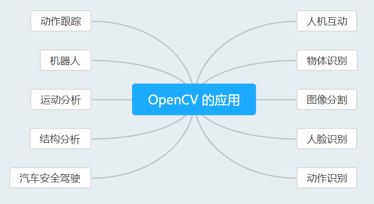

### 1.2 OpenCV-Python 简介

- OpenCV-Python 是 OpenCV 的 Python API，旨在解决计算机视觉问题的 Python 绑定库。
- OpenCV-Python 使用了 Numpy ，这是一个高度优化的库，用于使用 MATLAB 风格的语法进行数值运算。所有 OpenCV 数组结构都与 Numpy 数组相互转换。这也使与使用 Numpy 的其他库（例如 SciPy 和 Matplotlib ）的集成变得更加容易。

## 二. OpenCV 入门篇

- 本节主要介绍 OpenCV-Python 开发环境的搭建以及一系列基础的 OpenCV API，让读者对 OpenCV 的应用有一个初步的了解。

### 2.1 搭建 OpenCV 开发环境

- OpenCV 开发环境的搭建主要分为两个步骤，第一步是安装 Anaconda，第二步是安装 OpenCV-Python.

(1) 安装 Anaconda

Anaconda 是一个开源的 Python 发行版本，其包含了 conda、Python 等180多个科学包及其依赖项。通过安装 Anaconda ，能够大量减少配置 Python 环境的时间，减少许多不必要的麻烦。

- 下载 Anaconda
进入Anaconda官方网站 <https://www.anaconda.com/distribution> 下载相对的版本。    
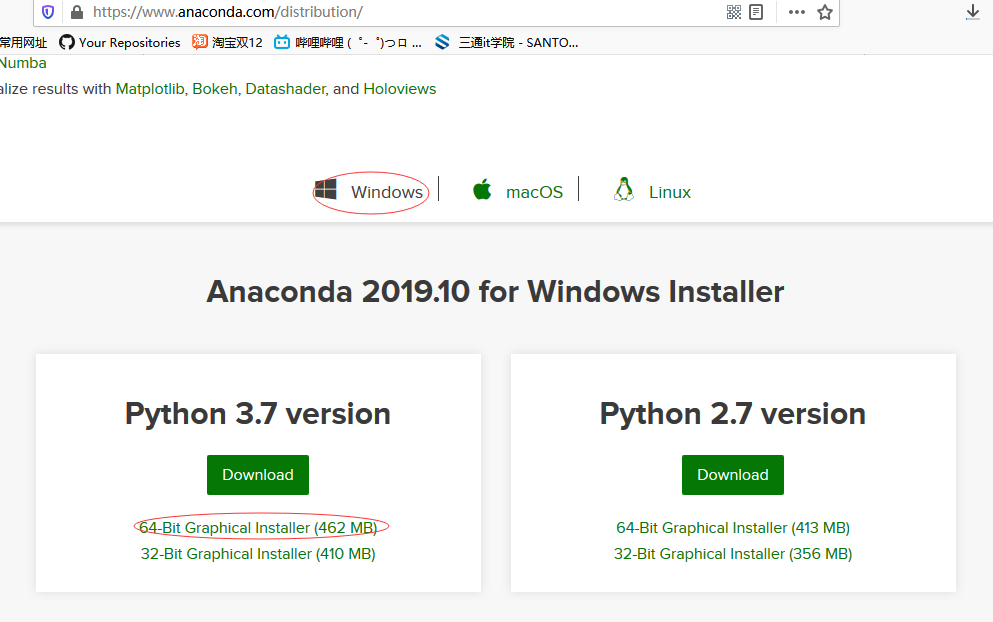  
选择 Python3.7 , 64 位版下载。  
- 安装 Anaconda  
在 Anaconda 的安装过程中，一般都是点击下一步就可以了。但有个地方要注意：
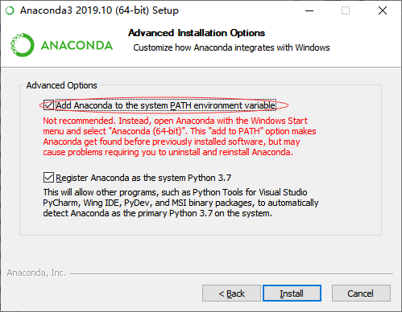  
画红圈的地方要勾选，将 Anaconda 添加到环境变量。
- 为Anaconda配置清华镜像源  
Anaconda 默认的镜像源都在国外，访问不但速度慢，而且经常不稳定。在国内使用的话，把 Anaconda 的镜像源配置为清华镜像源，不仅访问稳定，而且下载速度快，非常适合下载安装 Python 的各种函数库。  
在cmd下运行命令：conda config --set show_channel_urls yes，在用户目录下生成 .condarc 文件。  
修改.condarc文件里面的内容：

    ```python
    channels:
    - defaults
    show_channel_urls: true
    default_channels:
    - https://mirrors.tuna.tsinghua.edu.cn/anaconda/pkgs/main
    - https://mirrors.tuna.tsinghua.edu.cn/anaconda/pkgs/free
    - https://mirrors.tuna.tsinghua.edu.cn/anaconda/pkgs/r
    custom_channels:
    conda-forge: https://mirrors.tuna.tsinghua.edu.cn/anaconda/cloud
    msys2: https://mirrors.tuna.tsinghua.edu.cn/anaconda/cloud
    bioconda: https://mirrors.tuna.tsinghua.edu.cn/anaconda/cloud
    menpo: https://mirrors.tuna.tsinghua.edu.cn/anaconda/cloud
    pytorch: https://mirrors.tuna.tsinghua.edu.cn/anaconda/cloud
    simpleitk: https://mirrors.tuna.tsinghua.edu.cn/anaconda/cloud
    ssl_verify: true
    ```

- 修改 Aoaconda 的 Python 版本  
由于 Python-3.7 版本还没有经过系统的测试，可能存在不稳定的情况，为了避免这种情况。所以我们须更换稳定的版本，在这里，我们选用经过系统测试的 Python-3.6 版本。  
在cmd里面输入：conda install python=3.6 将 Aoaconda 的 Python 版本由 3.7 版本变更为 3.6 版本。  
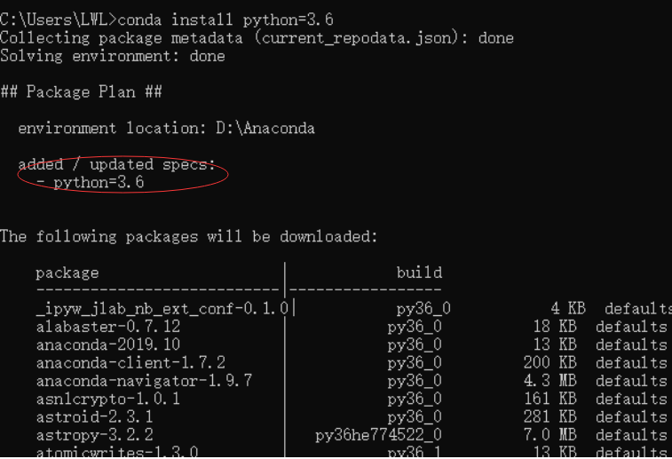  
下载完成后，可以在cmd输入ipython查看python版本.
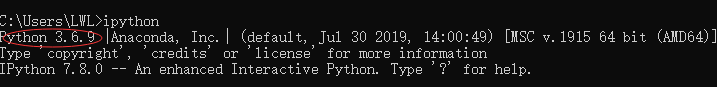  
从图中可以看到，当前python版本为3.6.9。

(2) 安装OpenCV-Python

- 下载 OpenCV-Python  
进入网站：<https://www.lfd.uci.edu/~gohlke/pythonlibs/#opencv> ，选择 opencv_python-4.1.2+contrib-cp36-cp36m-win_amd64.whl 文件开始下载。
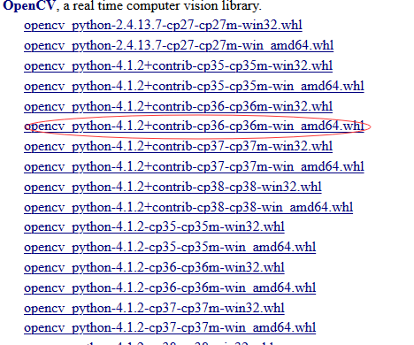  
- 安装OpenCV-Python  
下载完成后，在cmd输入：pip install + opencv_python-4.1.2+contrib-cp36-cp36m-win_amd64.whl 文件的绝对路径
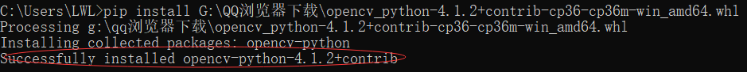  
如果出现：Successfully installed opencv-python-4.1.2+contrib，则表示安装成功。
- 版本验证  
进入 ipython ，输入：

    ```python
    >>> import cv2 
    >>> cv2.__version__
    ```

可以查看 OpenCV-Python 版本  
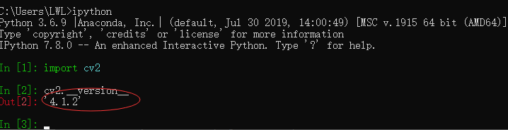  
从图中可以看出，当前 OpenCV-Python 版本为4.1.2.  

(3) 执行一个简单的Opencv程序
代码如下：( test_1_1_test_opencv.py)

```python
import cv2 as cv

image_data = cv.imread("./opencv_manual/test_image/lenacolor.png", cv.IMREAD_COLOR) # 读取图片数据
cv.imshow("Demo1", image_data)    # 显示图片
cv.waitKey(0)   # 等待用户按下按键
cv.destroyAllWindows()  # 摧毁所有显示图片的窗口
```

运行结果：  
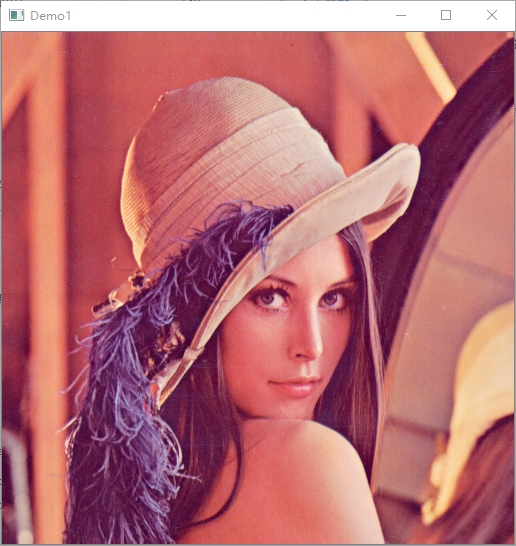

### 2.2 OpenCV 入门函数讲解

- 本小节主要讲述基本的 OpenCV 函数使用，包括简单的图片操作，简单的视频操操作以及画图功能。

#### 2.2.1 简单的图片操作

(1) 目标

- 学习如何读取图片，显示图片，保存图片
- 学习函数：cv.imread(), cv.imshow() , cv.imwrite()
- 在Matplotlib中显示图片

(2) 读取图片

- 使用函数 cv.imread() 读取图像。该图像应位于工作目录中，或者应提供完整的图像路径。
- 第二个参数是一个标志，用于指定应读取图像的方式.  

| 读取标志 |含义 | 数值 |  
|:----:|:----:|:----:|
|cv.IMREAD_COLOR|加载彩色图像。图像的透明度将被忽略。这是默认标志.|1|
|cv.IMREAD_GRAYSCALE :|以灰度模式加载图片|0|
|cv.IMREAD_UNCHANGED |保持原格式不变|-1|

- 代码演示：  

代码：(test_2_1_imread.py)

```python
import cv2 as cv

image = cv.imread("./opencv_manual/test_image/lena512.bmp", cv.IMREAD_UNCHANGED)
print("image的类型为：", type(image))# 打印图片类型
print("image = \n", image)# 打印图片数据
```

运行结果：  
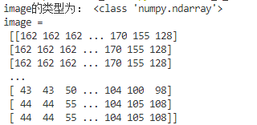  
从图中我们可以看出 cv2.imread() 的返回值为 numpy.ndarray 类型。

- 注意：  
如果图片的路径错误，不会有任何的错误输出，只是返回值为None。

(3) 显示图片

- 使用函数 cv.imshow() 在窗口中显示图像。窗口会自动适合图像尺寸。
- 第一个参数是窗口名称，它是一个字符串。第二个参数是我们的图片。您可以根据需要创建任意多个窗口，但窗口的名称要不相同。
- 代码演示：  
代码：(test_2_2_imshow.py)

```python
import cv2 as cv

image = cv.imread("./opencv_manual/test_image/lena512.bmp", cv.IMREAD_UNCHANGED)  # 读取图片
cv.imshow("Test_3", image)     # 开辟一个窗口显示图片
cv.waitKey(0)                  # 等待用户按下按键
cv.destroyAllWindows()         # 释放所有窗口
```  

运行结果：  
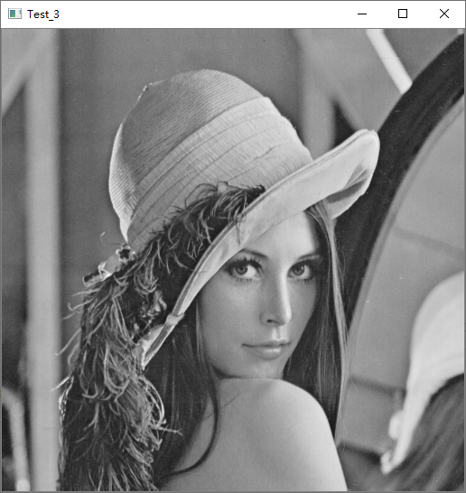  

(4) 写入图片

- 使用函数 cv.imwrite() 来保存图片
- 第一个参数是文件名，第二个参数是你想要保存的图片
- 代码演示：  
代码：(test_2_3_imwrite.py)  

```python
import numpy as np
import cv2 as cv

img = cv.imread("./opencv_manual/test_image/lena512.bmp", cv.IMREAD_UNCHANGED)    # 读取图片
cv.imshow("image", img)     # 显示图片
k = cv.waitKey(0)       # 等待用户按键
if(k == 27):            # 按下 ESC 键摧毁窗口
    cv.destroyAllWindows()
elif(k == ord('s')):     # 按下 S 键保存图片并退出
    cv.imwrite("messigray.png", img)
    cv.destroyAllWindows()
```

(5) 配合 Matplotlib 使用

- Matplotlib 是 Python 的绘图库，可为您提供多种绘图方法。在这里，您将学习如何使用 Matplotlib显示图像。您可以使用 Matplotlib 缩放图像，保存图像等。
- 代码演示：
代码：(test_2_4_use_matplotlib.py)

```python
import numpy as np
import cv2 as cv
from matplotlib import pyplot as plt

img = cv.imread("./opencv_manual/test_image/lena512.bmp", cv.IMREAD_UNCHANGED) # 读取图片
# 设置图片在 matplotlib 的显示方式
plt.imshow(img, cmap="gray", interpolation='bicubic')
plt.show()          # 显示图像
```  

运行结果：  
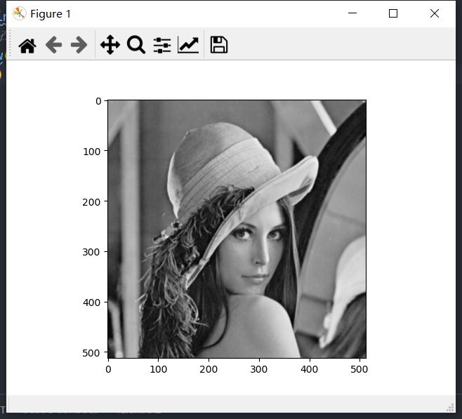

- 注意
OpenCV 加载的彩色图像处于 BGR 模式。但是Matplotlib 以 RGB 模式显示。因此，如果使用 OpenCV 读取彩色图像，则 Matplotlib 中将无法正确显示彩色图像。

#### 2.2.2 简单的视频操作

(1) 目标

- 学会读取视频，播放视频和保存视频
- 学习从相机捕捉和显示
- 学习函数：cv.VideoCapture(), cv.VideoWriter()

(2) 从相机捕获视频

- 想要捕获一个视频，你需要创建一个 VideoCapture 对象，它的参数可以是设备索引或视频文件名称。设备索引只是指定哪个摄像机的编号。相机捕获完成之后，需要使用 cap.release() 结束捕获。
- 代码演示：  
代码：(test_2_5_capture_video.py)

```python
import numpy as np
import cv2 as cv

cap = cv.VideoCapture(0)    # 创建 VideoCapture 对象
if not cap.isOpened():       # 相机打开失败
    print("相机打开失败")
    exit()                  # 退出程序

while True:
    # 一帧一帧的捕获，如果正确读取帧，ret 返回 True
    ret, frame = cap.read()

    if not ret:       # 读取帧出错
        print("不能接收帧，退出中 ...")
        break
    # 将 BGR 图像转化为灰度图
    gray = cv.cvtColor(frame, cv.COLOR_BGR2GRAY)

    # 显示图像，循环显示，相当于播放视频
    cv.imshow("frame", gray)
    if cv.waitKey(1) == ord('q'):       # 按下 Q 键退出
        break
cap.release()       # 在结尾的时候，一定要释放捕获
cv.destroyAllWindows()      # 摧毁所有创建的窗口
```

- cap.read() 返回一个布尔值 ( True/False ) 。如果读取正确，他将会返回 True 。
- cap.isOpened() 判断相机是否初始化成功。如果相机初始化成功，返回 True.
  
(3) 从文件播放视频

- 它与从摄像机捕获相同，只是摄像机索引更换为视频名称。在播放帧的时候，应选取适当的 cv.waitKey() 参数。如果参数过小，视频播放速度将会变得很快；参数过大，视频播放速度会变慢（这就是您可以慢动作显示视频的方式）。正常情况下25就可以了。
- 代码演示：
代码：(test_2_6_play_video.py)  

    ```python
    import numpy as np
    import cv2 as cv

    # 创建 VideoCapture 类
    cap = cv.VideoCapture("./opencv_manual/test_video/vtest.avi")  

    while cap.isOpened():       # 视频播放完毕，退出循环
        ret, frame = cap.read()     # 读取视频数据

        if not ret:                 # 读取数据出错
            print("视频解析失败，退出中 ...")
            break

        gray = cv.cvtColor(frame, cv.COLOR_BGR2GRAY)

        cv.imshow("frame", gray)    # 显示图片
        if cv.waitKey(25) == ord('q'):   # 控制播放速度，按 Q 键退出
            break
    cap.release()       # 关闭视频
    cv.destroyAllWindows()  # 摧毁所有创建的窗口
    ```

- 注意
确保安装了正确版本的 ffmpeg 或 gstreamer 。有时，使用 Video Capture 不能成功，主要是由于 ffmpeg / gstreamer 安装错误。

(4) 保存视频

- 对于保存图片，非常简单，仅仅使用 cv.imwrite() 就可以了。但对于保存视频来说，则需要做更多的工作。
- 在保存视频的时候，我们应该创建一个 VideoWriter 对象。在创建 VideoWriter 对象时，传入的参数有：输出文件名，指定 FourCC 编码，fps( frames per second 每秒的帧数) ，帧大小以及 isColor flag 标志。如果 isColor 为 True ，编码器使用彩色框，否则将与灰度框一起使用。  
- FourCC 是一个 4 字节的代码，用于指定视频编解码器。在<http://fourcc.org> 网站上，你可以找到可用的代码列表。它取决于平台。遵循编解码器对保存视频来说效果很好。
  - 在 Fedora 上：DIVX, XVID, MJPG, X264, WMV1, WMV2
  - 在 Windows 上：DIVX
  - 在 OSX 上：MJPG (.mp4), DIVX (.avi), X264 (.mkv)
- 对于 MJPG ，FourCC 代码以 cv.VideoWriter_fourcc('M','J','P','G') 或 cv.VideoWriter_fourcc(*'MJPG') 的形式传递。
- 代码演示：
代码：(test_2_7_save_video.py)

    ```python
    import numpy as np
    import cv2 as cv

    cap = cv.VideoCapture(0)        # 打开相机

    fourcc = cv.VideoWriter_fourcc(*'XVID')     # 定义编码对象
    # 创建 VideoWriter 对象
    out = cv.VideoWriter("output.avi", fourcc, 20.0 ,(640, 480))

    while cap.isOpened():
        ret, frame = cap.read() # 读取帧

        if not ret:         # 帧的读取结果有误
            print("不能接受数据帧。退出中 ...")
            exit

        out.write(frame)        # 写入帧

        cv.imshow("frame", frame)   # 显示图像

        if cv.waitKey(1) == ord('q'):   # 按 Q 退出
            break

    # 工作完成后，释放所有内容
    cap.release()
    out.release()

    cv.destroyAllWindows()  # 摧毁窗口
    ```

#### 2.2.3 OpenCV 中的绘图功能

(1) 目标

- 学习使用 OpenCV 绘制不同的几何形状
- 学习函数：cv.line(), cv.circle(), cv.rectangle(), cv.ellipse(), cv.putText()
  
(2) 参数
在上述的函数中，你将看到一些常见的参数，如下所示：

- img : 要添加图像的图片
- color : 形状的颜色。对于 BGR 图像而言，以元组的方式传递，如蓝色 (255, 0, 0) 。对于灰度图而言，仅仅传递灰度值就可以了。
- thickness : 线或圆等图形的粗细。如果对于封闭的图像（如圆）其thickness值为 -1 ，它将填充形状。默认值为 1 。
- lineType ：线的类型， 是否为 8-connected, anti-aliased 线等等。默认为 8-connected。
  
(3) 画线

- 要绘制一条线，你需要确定线的开始和结束坐标。
- 我们先创建一幅黑色背景图，然后在其左上角到右下角绘制一条蓝线。
- 代码演示：
代码：(test_2_8_draw_line.py)

    ```python
    import cv2 as cv
    import numpy as np

    img = np.zeros((512, 512, 3), dtype=np.uint8)  # 创建黑色背景图
    cv.imshow("img", img)   # 显示原图

    result = cv.line(img, (0 ,0), (511, 511), (0, 255, 0), 1)   # 在背景图上绘制线条
    cv.imshow("result", result)         # 显示处理结果图

    cv.waitKey(0)       # 等待按键
    cv.destroyAllWindows()  # 摧毁窗口
    ```

运行结果：  
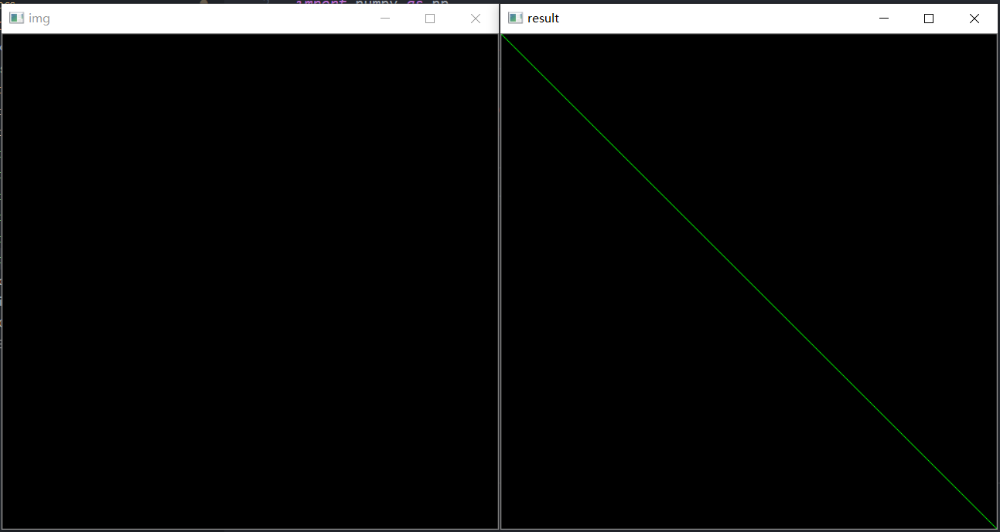

(4) 画矩形框

- 要绘制矩形，你需要矩形确定左上角和右下角的坐标  
- 代码演示：(test_2_9_drawing_rectangle.py)

```python
import numpy as np
import cv2 as cv

# 创建一个黑色图框
img = np.zeros((512,512,3), np.uint8)

# 绘制一个蓝色的矩形框
cv.rectangle(img, (100, 100), (200, 200), (255, 0, 0), -1)

cv.imshow("rectangle", img)         # 显示图片

cv.waitKey(0)

cv.destroyAllWindows()
```

运行结果：


(5) 绘制圆形

- 绘制圆形需要确定圆心点的位置和半径
- 代码演示：(test_2_10_draw_circle.py)
代码：

    ```python
    import cv2 as cv
    import numpy as np

    # 创建一个黑色图框
    img = np.zeros((512,512,3), np.uint8)

    # 绘制一个红色的圆
    cv.circle(img, (447,63), 63, (0,0,255), -1)

    cv.imshow("circle", img)         # 显示图片

    cv.waitKey(0)

    cv.destroyAllWindows()
    ```

运行结果：
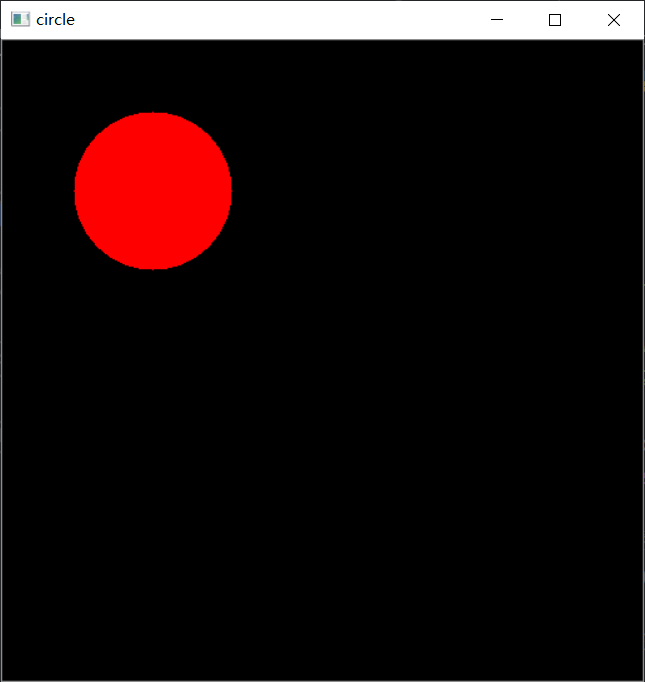

(5) 绘制椭圆

- 为了绘制椭圆，我们需要通过一系类的参数。首先我们需要确定椭圆中心坐标 (x, y) ，然后确定椭圆的轴长度（长轴长，短轴长），再确定椭圆在逆时针方向旋转的角度，最后确定起始角和结束角（起始角和结束角表示从长轴沿顺时针方向测量的椭圆弧的开始和结束。例如，给定0和360表示整个椭圆）
- 代码演示
代码：（test_2_11_draw_ellipse.py）

    ```python
    import cv2 as cv
    import numpy as np

    # 确定两个背景板，形成对比
    ellipse_1 = np.zeros((512,512,3), np.uint8)
    ellipse_2 = np.zeros((512,512,3), np.uint8)

    # 两者的起始角不同，一个为 0° ，一个为 90°
    cv.ellipse(ellipse_1, (256,256), (100,50), 0, 0, 360, 255, -1)
    cv.ellipse(ellipse_2, (256,256), (100,50), 0, 90, 360, 255, -1)

    # 显示图像
    cv.imshow("ellipse_1", ellipse_1)
    cv.imshow("ellipse_2", ellipse_2)

    cv.waitKey()

    cv.destroyAllWindows()
    ```

运行结果：
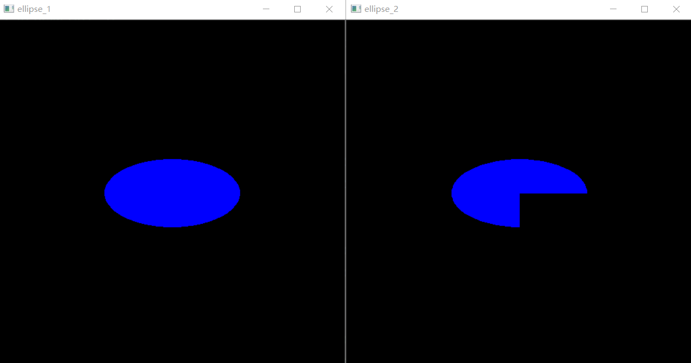

(6) 绘制多边形

- 要绘制多边形，我们需要确定各个顶点的位置，然后将各个顶点的位置变成 Rows * 1 * 2 的形状, Rows 是顶点的数目，其中数据类型要为 int32
- 代码演示:（test_2_12_draw_polygon）
代码：

    ```python
    import cv2 as cv
    import numpy as np

    # 确定两个背景板，形成对比
    img = np.zeros((512,512,3), np.uint8)

    # 确定 4 个点，四个点按照顺序连接成一个封闭图形
    pts = np.array([[50,15],[120,30],[170,50],[30,100]], np.int32)
    pts = pts.reshape((-1,1,2))         # 改变顶点 shape
    cv.polylines(img, [pts], True, (0,0,255))

    cv.imshow("polygon", img)

    cv.waitKey(0)
    cv.destroyAllWindows()
    ```

运行结果
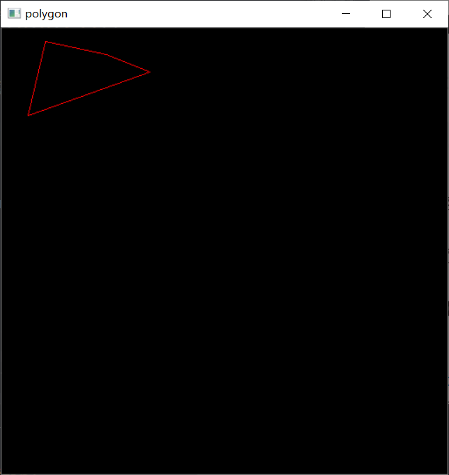

(7) 添加文本

- 在添加文本的时候，需要指定下列参数：
  - 要添加的文本（不支持中文）
  - 文本的位置
  - 字体类型
  - 字体大小
- 字体类型请查看：[字体类型](https://docs.opencv.org/4.2.0/d6/d6e/group__imgproc__draw.html#ga0f9314ea6e35f99bb23f29567fc16e11)
- 代码演示(test_2_13_puttext.py)
代码：

    ```python
    import cv2 as cv
    import numpy as np

    img = np.zeros((512,512,3), np.uint8)

    font = cv.FONT_HERSHEY_SIMPLEX  # 确定字体类型
    cv.putText(img, 'OpenCV', (10,400), font, 4, (255,255,255), 2 , cv.LINE_AA)

    cv.imshow("text", img)      # 图片显示

    cv.waitKey(0)
    cv.destroyAllWindows()
    ```

运行结果：
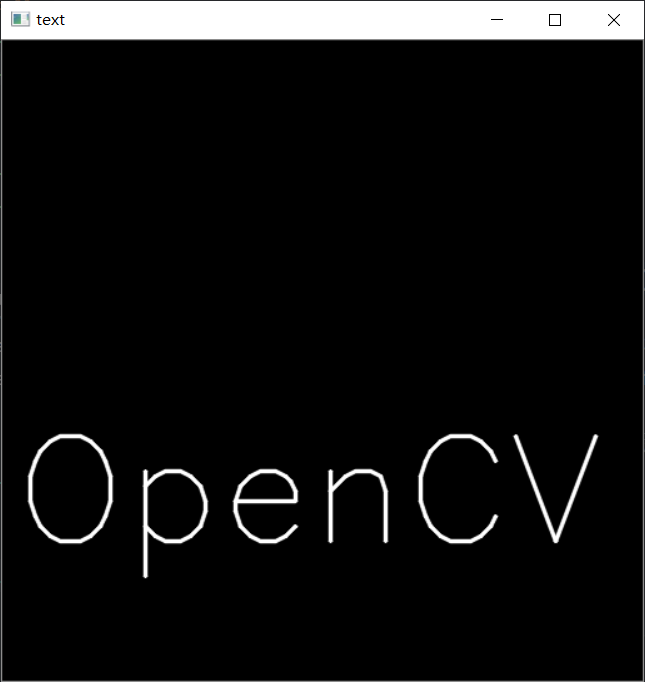

## 三. OpenCV 进阶篇

- 本节主要学习 OpenCV 中一些比较重要的操作，包括 OpenCV 核心操作和 OpenCV 图像处理。

### 3.1 OpenCV 核心操作

#### 3.1.1 基本的图片操作

(1) 目标

- 访问像素值并且修改他们
- 访问图片属性
- 设置 ROI
- 合并和分离图片

(2) 访问和修改像素值

- 首先载入一张图片
  
    ```python
    >>> import numpy as np
    >>> import cv2 as cv
    >>> img = cv.imread('./opencv_manual/test_image/lenacolor.png')
    ```

- 然后可以通过行和列坐标访问像素值。对于 BGR 图片，返回值为一个 B ，G ，R 值矩阵。对于灰度图片，则返回相应的灰度值。
  
    ```python
    >>> px = img[100,100]
    >>> print( px )
    [ 78  68 178]

    # 仅访问一个 blue 像素
    >>> blue = img[100,100,0]
    >>> print(blue)
    78
    ```

- 通过相同的方式，你可以修改像素值

    ```python
    >>> img[100,100] = [255,255,255]
    >>> print(img[100, 100])
    [255 255 255]
    ```

- 警告
Numpy 是一个用于快速数组计算的优化库。因此，简单地访问每个像素值并修改它将非常缓慢，这是不可取的。

(3) 获取图片属性

- 图片属性包括图片的行数，列数和通道数，图片数据的类型以及像素数等等。
- 通过 img.shape 获取的形状。它将返回图片的行数，列数以及通道数（如果为彩色图片）。

    ```python
    >>> print(img.shape)
    (512, 512, 3)
    ```

- 通过 img.size 获取图片的像素数目。

    ```python
    >>> print(img.size)
    786432
    ```

- 通过 img.dtype 获取图片数据类型
  
    ```python
    >>> print(img.dtype)
    uint8
    ```

(4) 分离图像通道

- 有时候，我们为了工作需求必须分离图片的 B，G，R 通道。在这种情况下，你需使用 cv.split() 函数将 BGR 图片转变成单通道。
  
    ```python
    >>> b, g, r = cv.split(img)
    >>> print("b shape is", b.shape, "\ng shape is", g.shape, "\nr shape is", r.shape)
    b shape is (512, 512)
    g shape is (512, 512)
    r shape is (512, 512)
    ```

- 也可以使用 numpy 操作
  
    ```python
    >>> b = img[:,:,0]
    >>> print("b shape is",b.shape)
    b shape is (512, 512)
    ```

- 注意
cv.split() 会花费大量的时间，所以只有你需要用到的时候才去使用。最好用 numpy 索引。

(5) 为图像制作边框

- 如果你想为图片制作边框，你可以使用 cv.copyMakeBorder() 函数。
- 它的主要参数有：
  - src : 输入图像
  - top, bottom, left, right : 在指定边缘的像素点宽度
  - borderType : 想要添加的边缘类型。它有下列类型：
    - cv.BORDER_CONSTANT : 添加一个固定颜色的边框
    - cv.BORDER_REFLECT ：边界将是边界元素的镜像反射
    - cv.BORDER_REFLECT_101 or cv.BORDER_DEFAULT : 与上面相同，仅有稍微不同
    - cv.BORDER_REPLICATE :最后一个像素点将被复制
    - cv.BORDER_WRA
  - value : 边界颜色，如果边界类型为 cv.BORDER_CONSTANT，则需用到。

- 代码演示：（test_3_1_image_border.py）
代码：

    ```python
    import cv2 as cv
    import numpy as np
    from matplotlib import pyplot as plt

    # 读取图片
    img1 = cv.imread("./opencv_manual/test_image/OpenCVLogo.jpg")

    # 为图片添加不同类型的边框
    replicate = cv.copyMakeBorder(img1,10,10,10,10,cv.BORDER_REPLICATE)
    reflect = cv.copyMakeBorder(img1,10,10,10,10,cv.BORDER_REFLECT)
    reflect101 = cv.copyMakeBorder(img1,10,10,10,10,cv.BORDER_REFLECT_101)
    wrap = cv.copyMakeBorder(img1,10,10,10,10,cv.BORDER_WRAP)
    BLUE = [255,0,0]
    constant= cv.copyMakeBorder(img1,10,10,10,10,cv.BORDER_CONSTANT,value=BLUE)

    # 显示不同类型的边框图片
    plt.subplot(231),plt.imshow(img1,'gray'),plt.title('ORIGINAL')
    plt.subplot(232),plt.imshow(replicate,'gray'),plt.title('REPLICATE')
    plt.subplot(233),plt.imshow(reflect,'gray'),plt.title('REFLECT')
    plt.subplot(234),plt.imshow(reflect101,'gray'),plt.title('REFLECT_101')
    plt.subplot(235),plt.imshow(wrap,'gray'),plt.title('WRAP')
    plt.subplot(236),plt.imshow(constant,'gray'),plt.title('CONSTANT')
    plt.show()
    ```

    运行结果：
    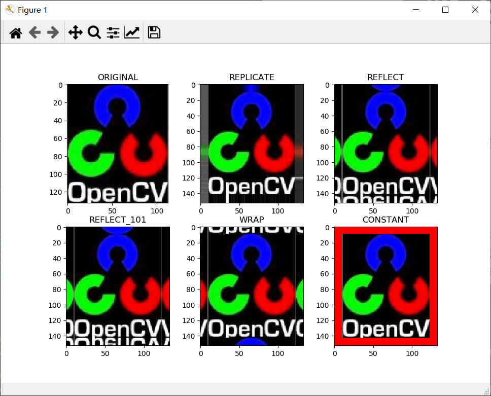  
注意：在使用 Matplotlib，颜色通道发生了改变。

#### 3.1.2 图像的算术运算

(1) 目标

- 学习一系类的图片算术运算，包括加，减，按位操作等等。
- 学习函数： cv.add(), cv.addWeighted() 等

(2) 图片相加

- 你可以使用 OpenCV 的 cv.add() 函数，也可是使用 Numpy 直接进行相加：res = img1 + img2 。两幅图片的深度和类型应该相同。
- 注意：
cv.add() 是一个饱和运算，而 Numpy 的加法是一个取模运算。
- 请看以下实例：

    ```python
    >>> x = np.uint8([122])
    >>> y = np.uint8([178])
    >>> print(x + y)        # 122 + 178 = 300 % 256 => 44
    [44]
    >>> print(cv.add(x, y))     # 122 + 178 = 300 => 255
    [[255]]
    ```

(3) 图像混合

- 这也是一种图片相加，但是为了体现图片混合或是图片透明的效果，不同的图片被给予不同的权重。图片混合按照以下公式：
  
```math
g(x) = (1 - \alpha)f_0(x) + \alpha f_1(x)
```

- 通过从 0 $\rightarrow$ 1 改变 $\alpha$ ，可以在一个图像到另一个图像之间执行冷转换。
- 代码演示：
代码：

    ```python
    import cv2 as cv
    import numpy as np
    from matplotlib import pyplot as plt

    # 读取图片
    img1 = cv.imread("./opencv_manual/test_image/boat.bmp")
    img2 = cv.imread("./opencv_manual/test_image/dollar.bmp")

    # 图片按照不同的权重进行相加
    dst = cv.addWeighted(img1, 0.8, img2, 0.2, 0)

    # 显示图片
    plt.subplot(131),plt.imshow(img1,'gray'),plt.title('img1')
    plt.subplot(132),plt.imshow(img2,'gray'),plt.title('img2')
    plt.subplot(133),plt.imshow(dst,'gray'),plt.title('dst')
    plt.show()

    cv.waitKey(0)
    cv.destroyAllWindows()
    ```

    运行结果：
    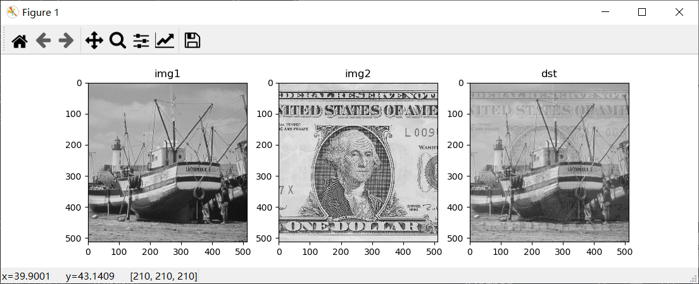

- 其中 cv.addWeighted() 函数的公式为：

```math
dst = \alpha \cdot img1 + \beta \cdot img2 + \gamma
```

(4) 按位运算

- 按位运算包括按位与，按位或，按位非以及按位异或运算。在提取图像的任何部分、定义以及使用非矩形 ROI 等时，它们将发挥重大作用。
- 代码演示：（test_3_2_bitwise.py）
代码：

    ```python
    ```

    运行结果：

#### 3.1.3 性能测量

(1) 目标

- 衡量代码的性能
- 学习函数 : cv.getTickCount(), cv.getTickFrequency()

(2) 用 OpenCV 来测量性能

- cv.getTickCount() 函数用于返回从操作系统启动到当前所经的计时周期数。
- cv.getTickFrequency() 用于返回CPU的频率。
- 代码演示( test_3_4_measuring_performance.py)
代码：

    ```
    import cv2 as cv

    # 获取运行前的时间戳
    start_tick = cv.getTickCount()

    # 从 0 加到 1000
    for i in range(1001):
        y += i

    # 获取运行后的时间戳
    end_tick = cv.getTickCount()

    # 打印 CPU 频率
    print("TickFrequency :", cv.getTickFrequency())

    # 打印从 0 加到 1000 所用的时间
    print((end_tick - start_tick)/cv.getTickFrequency())
    ```

    运行结果

    ```python
    TickFrequency : 10000000.0
    0.000114
    ```

### 3.2 OpenCV 图像处理

- 本小节你将学习到 OpenCV 中许多的图像处理函数

#### 3.2.1 改变色彩空间

(1) 目标

- 学习怎样从一个色彩空间转换到另一个色彩空间，向从 BGR $\leftrightarrow$ RGB , BGR $\leftrightarrow$ HSV 等。
- 创建一个应用程序提取视频中的彩色对象。
- 学习函数：cv.cvtColor(), cv.inRange() 等。

(2) 改变色彩空间

- 在 OpenCV 中，有超过 150 多种色彩空间转变的方法。但是，我们今天只讲两种最常用的色彩空间转换，BGR $\leftrightarrow$ Gray , BGR $\leftrightarrow$ HSV 。
- 对于色彩空间转换，我们使用  cv.cvtColor(input_image, flag) 函数。其中 flag 决定转换的类型。从 BGR $\rightarrow$ Gray 的 flag 是 cv.COLOR_BGR2GRAY ，从 BGR $\rightarrow$ HSV 的 flag 是  cv.COLOR_BGR2HSV 。

(3) 目标跟踪

- 在学会 BGR $\rightarrow$ HSV 后，我们就可以使用它去提取色彩目标。在 HSV 中，比在 BGR 确定颜色更容易。在我们的应用程序中，我们将会去捕捉蓝色目标。
- 应用程序方法步骤：
    1. 提取视频的每一帧
    2. 从 BGR 色彩空间转换到 HSV 色彩空间
    3. 在 HSV 图像中设为蓝色范围为阈值
    4. 然后提取蓝色物体
- 代码演示：（test_3_5_colored_tracking.py）
代码：

    ```python
    import cv2 as cv
    import numpy as np

    cap = cv.VideoCapture(0)

    while(1):
    # 提取每一帧
    _, frame = cap.read()
    # 色彩空间转换
    hsv = cv.cvtColor(frame, cv.COLOR_BGR2HSV)
    # 设定在 HSV 中蓝色的取值范围
    lower_blue = np.array([110,50,50])
    upper_blue = np.array([130,255,255])
    # 进行二值化处理
    mask = cv.inRange(hsv, lower_blue, upper_blue)
    # 按位运算，得到蓝色区域
    res = cv.bitwise_and(frame,frame, mask= mask)
    cv.imshow('frame',frame)
    cv.imshow('mask',mask)
    cv.imshow('res',res)
    k = cv.waitKey(5) & 0xFF
    if k == 27:
        break
    cv.destroyAllWindows()
    ```

#### 3.2.2 图像的几何变换

(1) 目标

- 学会使用不同的图片几何变换，比如翻转，旋转，仿射变换等。
- 学习函数：cv.getPerspectiveTransform()

(2) 变幻操作

- OpenCV 提供两个翻转函数，cv.warpAffine() 和 cv.warpPerspective() ，使用它们可以执行各种翻转。
- cv.warpAffine() 采用 2 * 3 的输入转换矩阵
- cv.warpPerspective() 采用 3 * 3 的输入转换矩阵。

(3) 缩放

- 缩放只是改变图像的尺寸。OpenCV 使用 cv.resize() 来实现图片缩放。
- 代码演示(test_3_6_image_resize.py)
代码：

    ```python
    import numpy as np
    import cv2 as cv
    img = cv.imread('./opencv_manual/test_image/messi5.jpg')
    # 图片扩大两倍
    res = cv.resize(img,None,fx=2, fy=2, interpolation = cv.INTER_CUBIC)

    cv.imshow("original", img)
    cv.imshow("res", res)

    cv.waitKey(0)
    cv.destroyAllWindows()
    ```

(4) 转动

- 转动是物体位置的转移。如果你想要点 (x, y) 变成 ($t_x$, $t_y$。你先需创建一个矩阵：

```math
 \begin{bmatrix}
    1 & 0 & t_x \\
    0 & 1 & t_y \\
\end{bmatrix}
```

- 然后使用 cv.warpAffine() 函数。

- 代码演示
代码：

    ```python
    import numpy as np
    import cv2 as cv
    img = cv.imread('./opencv_manual/test_image/messi5.jpg',0)
    rows,cols = img.shape
    M = np.float32([[1,0,100],[0,1,50]])
    dst = cv.warpAffine(img,M,(cols,rows))
    cv.imshow('img',dst)
    cv.waitKey(0)
    cv.destroyAllWindows()
    ```

(5) 旋转

- 图像的旋转是通过矩阵

```math
\begin  {bmatrix}
        cos\theta & -sin\theta \\
        sin\theta & cos\theta  \\
\end    {bmatrix}
```

来实现的。

- 代码演示：(test_3_8_rotation.py)
代码

    ```python
    import cv2 as cv

    img = cv.imread('./opencv_manual/test_image/messi5.jpg',0)
    rows,cols = img.shape
    # cols-1 and rows-1 are the coordinate limits.
    M = cv.getRotationMatrix2D(((cols-1)/2.0,(rows-1)/2.0),90,1)
    print(M)
    dst = cv.warpAffine(img,M,(cols,rows))

    cv.imshow("dst", dst)
    cv.waitKey(0)
    cv.destroyAllWindows()
    ```

    运行结果：
    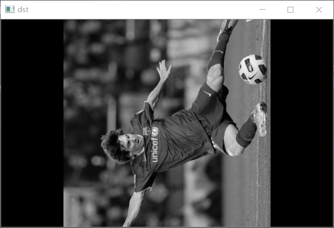

(6) 仿射变换

- 在仿射变换中，原始图像中的所有平行线在输出图像中仍然是平行的。为了找到转换矩阵，我们需要输入三个点和它们在输出图片中的位置。
- 然后通过 cv.getAffineTransform() 函数得到 2*3 的矩阵。
- 最后在使用 cv.warpAffine() 函数。
- 代码演示：(test_3_9_affine_transformation.py)
代码：

    ```python
    import cv2 as cv
    import numpy as np
    from matplotlib import pyplot as plt

    img = cv.imread('./opencv_manual/test_image/sudoku.png')
    rows,cols,ch = img.shape
    pts1 = np.float32([[50,50],[200,50],[50,200]])
    pts2 = np.float32([[10,100],[200,50],[100,250]])
    M = cv.getAffineTransform(pts1,pts2)
    dst = cv.warpAffine(img,M,(cols,rows))
    plt.subplot(121),plt.imshow(img),plt.title('Input')
    plt.subplot(122),plt.imshow(dst),plt.title('Output')
    plt.show()
    ```

    运行结果：  
    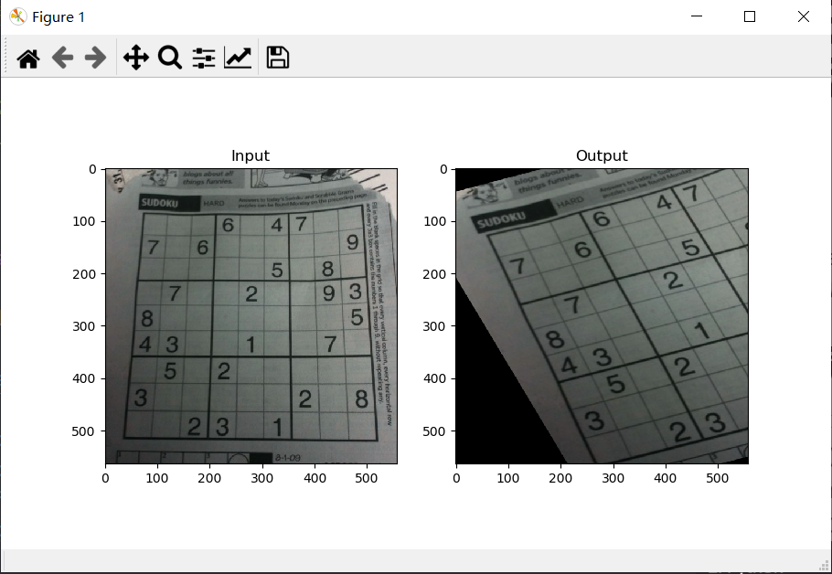

(7) 投影变换

- 投影变换需要 3 * 3 的矩阵。经过变换之后，直线依旧是直线。
- 为了找到变换矩阵，你需要 4 个点和在输出图像上对应的 4 个点。
- 在 4 个点中， 有 3 个点不共线。
- 然后可以通过 cv.getPerspectiveTransform() 函数，得到对应的变换矩阵。
- 最后使用 cv.warpPerspective() 矩阵。
- 代码演示(test_3_10_perspective_transformation.py)
代码：

    ```python
    import numpy as np
    import cv2 as cv
    from matplotlib import pyplot as plt


    img = cv.imread('./opencv_manual/test_image/sudoku.png')
    rows,cols,ch = img.shape
    pts1 = np.float32([[56,65],[368,52],[28,387],[389,390]])
    pts2 = np.float32([[0,0],[300,0],[0,300],[300,300]])
    M = cv.getPerspectiveTransform(pts1,pts2)
    dst = cv.warpPerspective(img,M,(300,300))
    plt.subplot(121),plt.imshow(img),plt.title('Input')
    plt.subplot(122),plt.imshow(dst),plt.title('Output')
    plt.show()
    ```

    运行结果：
    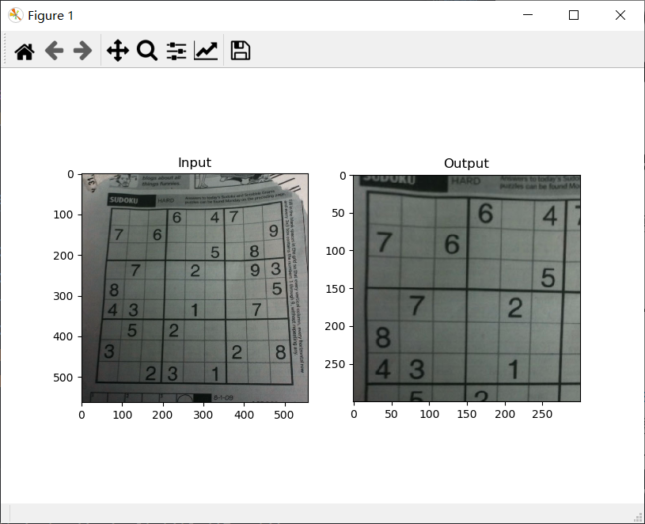

#### 3.2.3 图像阈值化

(1) 目标

- 学习简单阈值化，自适应阈值化以及 Otsu's 二值化
- 学习函数：cv.threshold() 和 cv.adaptiveThreshold()

(2) 简单阈值化

- 在简单阈值化中，所有的像素的阈值都相同。如果，像素值小于阈值，它将被置为 0 ；如果，像素值大于阈值，它将被置为最大值。
- 简单阈值化使用 cv.threshold() 函数来实现。cv.threshold() 函数的第一个参数是输入图片，第二个参数是阈值，第三个参数是最大值，第四个参数
- 代码演示(test_3_11_threshold.py)
代码：

    ```python
    import cv2 as cv
    import numpy as np
    from matplotlib import pyplot as plt

    img = cv.imread('./opencv_manual/test_image/gradient.png',0)
    ret,thresh1 = cv.threshold(img,127,255,cv.THRESH_BINARY)
    ret,thresh2 = cv.threshold(img,127,255,cv.THRESH_BINARY_INV)
    ret,thresh3 = cv.threshold(img,127,255,cv.THRESH_TRUNC)
    ret,thresh4 = cv.threshold(img,127,255,cv.THRESH_TOZERO)
    ret,thresh5 = cv.threshold(img,127,255,cv.THRESH_TOZERO_INV)
    titles = ['Original Image','BINARY','BINARY_INV','TRUNC','TOZERO','TOZERO_INV']
    images = [img, thresh1, thresh2, thresh3, thresh4, thresh5]
    for i in range(6):
        plt.subplot(2,3,i+1),plt.imshow(images[i],'gray')
        plt.title(titles[i])
        plt.xticks([]),plt.yticks([])
    plt.show()
    ```

    运行结果：
    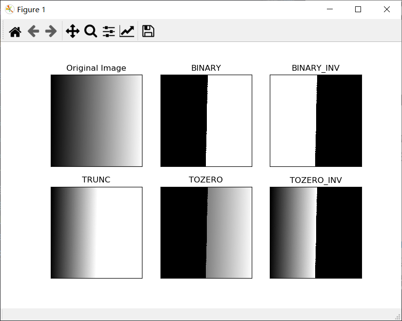

(3) 自适应阈值化

- 在先前的部分，我们使用一个全局值作为阈值。但是这种方式并不适用于所有的场景。例如，如果图像在不同区域具有不同的照明条件。在这种情况下，自适应阈值化可以帮助你。
- 在自适应阈值化中，算法根据像素周围的一个小区域来确定像素的阈值。
- 因此，对于同一幅图像的不同区域，我们得到了不同的阈值，对于不同光照的图像，得到了更好的结果。
- 对于自适应阈值化，我们使用 cv.adaptiveThreshold() 来实现。
- 代码演示（test_3_12_adaptive_threshlod.py）

    ```python
    import cv2 as cv
    import numpy as np
    from matplotlib import pyplot as plt
    img = cv.imread('./opencv_manual/test_image/sudoku.png',0)
    img = cv.medianBlur(img,5)
    ret,th1 = cv.threshold(img,127,255,cv.THRESH_BINARY)
    th2 = cv.adaptiveThreshold(img,255,cv.ADAPTIVE_THRESH_MEAN_C,\
                cv.THRESH_BINARY,11,2)
    th3 = cv.adaptiveThreshold(img,255,cv.ADAPTIVE_THRESH_GAUSSIAN_C,\
                cv.THRESH_BINARY,11,2)
    titles = ['Original Image', 'Global Thresholding (v = 127)',
                'Adaptive Mean Thresholding', 'Adaptive Gaussian Thresholding']
    images = [img, th1, th2, th3]
    for i in range(4):
        plt.subplot(2,2,i+1),plt.imshow(images[i],'gray')
        plt.title(titles[i])
        plt.xticks([]),plt.yticks([])
    plt.show()
    ```

    运行结果：  
    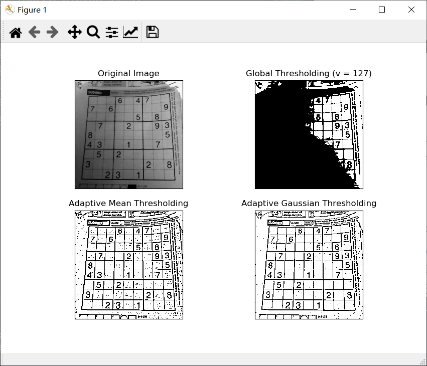

(4) Otsu's 二值化

- 在全局阈值化中，我们任意选择值作为阈值。然而，使用 Otsu's 方法就不用去选择阈值了。
- 待写。

#### 3.2.4 图像平滑

(1) 目标

- 用各种低通滤波器模糊图像
- 对图像应用自定义筛选器

(2) 二维卷积

- 与一维信号一样，图像也可以用各种低通滤波器（LPF）、高通滤波器（HPF）等进行滤波。
- LPF 可以用来移除噪点，模糊图像等。HPF 帮助找到图像的边缘。
- OpenCV 提供 cv.filter2D() 来使核与图片进行卷积。
- 加入我们想对一个图片进行均值滤波。首先，我们要构建一个 5 * 5 的滤波核

```math
    k = \frac{1}{25}
    \begin  {bmatrix}
    1 & 1 & 1 & 1 & 1\\
    1 & 1 & 1 & 1 & 1\\
    1 & 1 & 1 & 1 & 1\\
    1 & 1 & 1 & 1 & 1\\
    1 & 1 & 1 & 1 & 1\\
    \end    {bmatrix}
```

- 该操作的工作原理如下：将此核里所有25个像素相加，取平均值，并用新的平均值替换中心像素。

- 代码演示（test_3_14_averaging_filter.py）
代码：

    ```python
    import numpy as np
    import cv2 as cv
    from matplotlib import pyplot as plt

    img = cv.imread('./opencv_manual/test_image/opencv-logo.png')
    kernel = np.ones((5,5),np.float32)/25
    dst = cv.filter2D(img,-1,kernel)
    plt.subplot(121),plt.imshow(img),plt.title('Original')
    plt.xticks([]), plt.yticks([])
    plt.subplot(122),plt.imshow(dst),plt.title('Averaging')
    plt.xticks([]), plt.yticks([])
    plt.show()
    ```

    运行结果：
    

(2) 图像模糊

- 图像模糊通过图片与一个低通滤波核完成。它用于消除噪音。他能移除图片的高频内容。

(3) 均值模糊

- 图片通过与一个归一化块滤波核进行卷积。他只是简单对核里面的像素求取平均值，然后替换中心元素。
- 均值模糊使用函数 cv.blur() 和  cv.boxFilter() 来完成。
- 代码演示(test_3_15_averaging_blur.py)
代码：

    ```python
    import cv2 as cv
    import numpy as np
    from matplotlib import pyplot as plt

    img = cv.imread('./opencv_manual/test_image/opencv-logo.png')
    blur = cv.blur(img,(5,5))
    plt.subplot(121),plt.imshow(img),plt.title('Original')
    plt.xticks([]), plt.yticks([])
    plt.subplot(122),plt.imshow(blur),plt.title('Blurred')
    plt.xticks([]), plt.yticks([])
    plt.show()
    ```

    运行结果：
    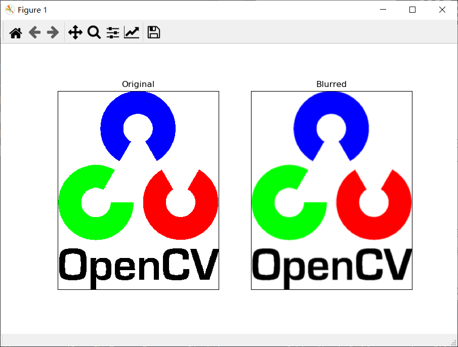


(4) 高斯模糊

- 在高斯模糊中，使用的是高斯滤波核来代替归一化块滤波核。
- 使用函数 cv.GaussianBlur() 来完成高斯模糊。
- 代码演示（test_3_16_Gaussian_blur.py）
代码：

    ```python
    import cv2 as cv
    import numpy as np
    from matplotlib import pyplot as plt

    img = cv.imread('./opencv_manual/test_image/opencv-logo.png')
    blur = cv.GaussianBlur(img,(5,5),0)
    plt.subplot(121),plt.imshow(img),plt.title('Original')
    plt.xticks([]), plt.yticks([])
    plt.subplot(122),plt.imshow(blur),plt.title('Blurred')
    plt.xticks([]), plt.yticks([])
    plt.show()
    ```

    运行结果：
    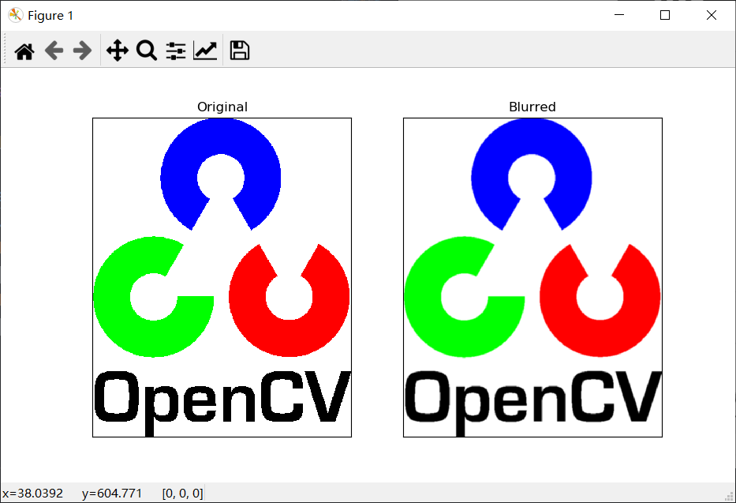

(5) 中值模糊

- 中值滤波使用 cv.medianBlur() 来实现。
- 代码演示（test_3_17_median_blur.py）
代码：

    ```python
    import cv2 as cv
    import numpy as np
    from matplotlib import pyplot as plt

    img = cv.imread('./opencv_manual/test_image/opencv-logo.png')
    blur = cv.GaussianBlur(img,(5,5),0)
    plt.subplot(121),plt.imshow(img),plt.title('Original')
    plt.xticks([]), plt.yticks([])
    plt.subplot(122),plt.imshow(blur),plt.title('Blurred')
    plt.xticks([]), plt.yticks([])
    plt.show()
    ```

    运行结果：
    

(6) 双边滤波

#### 3.2.5 形态学变换

(1) 目标

- 学习不同的形态学操作，包括腐蚀，膨胀，开运算，闭运算等。
- 学习函数：cv.erode(), cv.dilate(), cv.morphologyEx() 。

(2) 理论

- 形态学操作是基于图片形状的一些简单操作。通常在二值图片上进行。
- 它需要两个输入，一个是原始图片，第二个是决定操作性质的结构元素或内核。
- 最简单的形态学操作是腐蚀和膨胀。
- 开运算，闭运算等都是在此基础上进行的。

(3) 腐蚀

- 腐蚀的基本概念就像土壤侵蚀一样，它侵蚀了前景对象的边界（总是尽量保持前景对象为白色）
- 代码演示（test_3_18_erosion.py）
代码：

    ```python
    import cv2 as cv
    import numpy as np
    from matplotlib import pyplot as plt

    img = cv.imread('./opencv_manual/test_image/j.png',0)
    kernel = np.ones((5,5),np.uint8)
    erosion = cv.erode(img,kernel,iterations = 1)

    plt.subplot(121),plt.imshow(img, 'gray'),plt.title('Original')
    plt.xticks([]), plt.yticks([])
    plt.subplot(122),plt.imshow(erosion, 'gray'),plt.title('erosion')
    plt.xticks([]), plt.yticks([])
    plt.show()
    ```

    运行结果：
    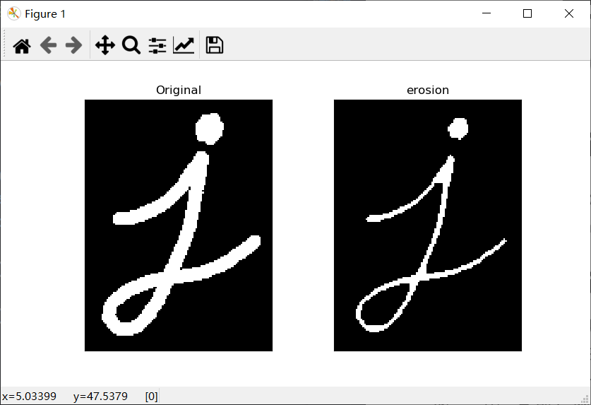

(4) 膨胀

- 正好与腐蚀相反。
- 代码演示（test_3_19_dilation.py）
代码：

    ```python
    import cv2 as cv
    import numpy as np
    from matplotlib import pyplot as plt

    img = cv.imread('./opencv_manual/test_image/j.png',0)
    kernel = np.ones((5,5),np.uint8)
    dilation = cv.dilate(img,kernel,iterations = 1)

    plt.subplot(121),plt.imshow(img, 'gray'),plt.title('Original')
    plt.xticks([]), plt.yticks([])
    plt.subplot(122),plt.imshow(dilation, 'gray'),plt.title('dilation')
    plt.xticks([]), plt.yticks([])
    plt.show()
    ```

    运行结果：
    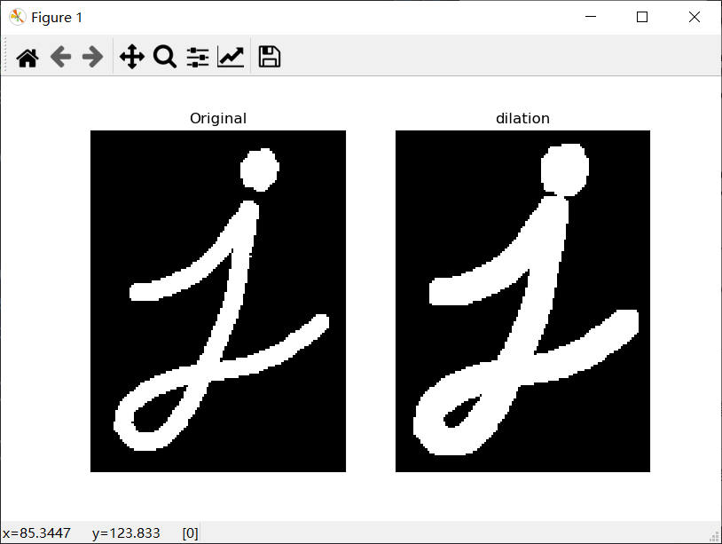

(5) 开运算

- 开运算是先腐蚀后膨胀。
- 代码演示（test_3_20_opening.py）
代码：

    ```python
    import cv2 as cv
    import numpy as np
    from matplotlib import pyplot as plt

    img = cv.imread('./opencv_manual/test_image/opening.bmp',0)
    kernel = np.ones((5,5), np.uint8)
    opening = cv.morphologyEx(img, cv.MORPH_OPEN, kernel)

    plt.subplot(121),plt.imshow(img, 'gray'),plt.title('original')
    plt.xticks([]), plt.yticks([])
    plt.subplot(122),plt.imshow(opening, 'gray'),plt.title('opening')
    plt.xticks([]), plt.yticks([])
    plt.show()
    ```

    运行结果：
    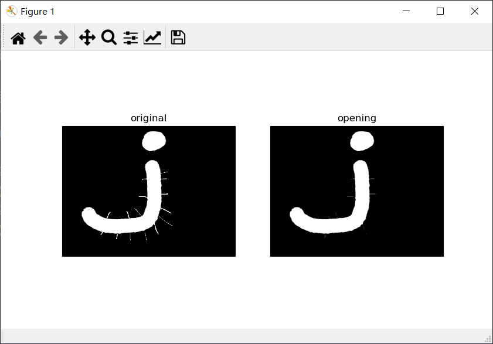

(6) 闭运算

- 闭运算与开运算相反，先膨胀后腐蚀。
- 它用于填充前景对象里的小孔或是对象上的小黑点。
- 代码演示（test_3_21_closing.py）

    ```python
    import cv2 as cv
    import numpy as np
    from matplotlib import pyplot as plt

    img = cv.imread('./opencv_manual/test_image/closing.bmp',0)
    kernel = np.ones((10,10), np.uint8)
    closing = cv.morphologyEx(img, cv.MORPH_CLOSE, kernel)

    plt.subplot(121),plt.imshow(img, 'gray'),plt.title('original')
    plt.xticks([]), plt.yticks([])
    plt.subplot(122),plt.imshow(closing, 'gray'),plt.title('closing')
    plt.xticks([]), plt.yticks([])
    plt.show()
    ```

    运行结果:
    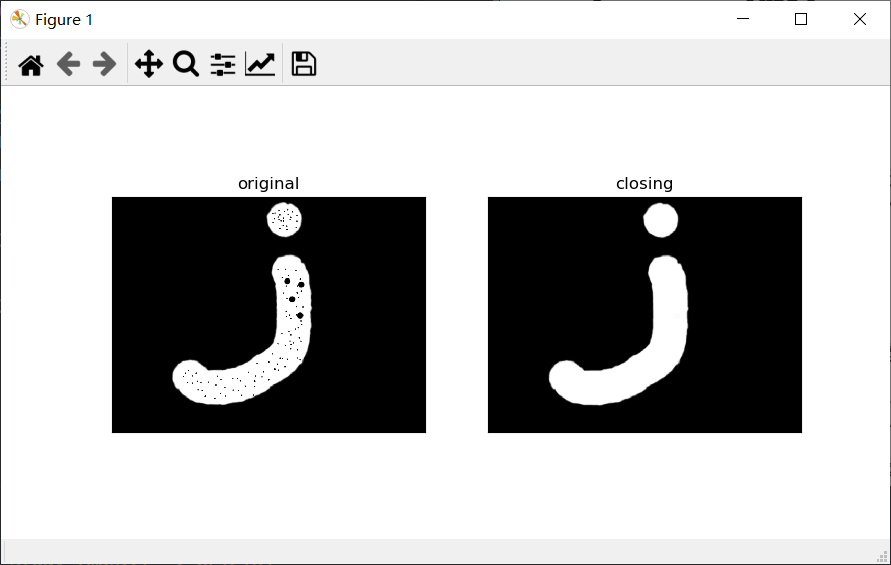

(7) 形态学梯度

- 形态学梯度的运算是膨胀图像减去膨胀图像
- 它会提取对象的轮廓
- 代码演示（test_3_22_morphological_gradient.py）
代码：

    ```python
    import cv2 as cv
    import numpy as np
    from matplotlib import pyplot as plt

    img = cv.imread('./opencv_manual/test_image/gradient.bmp',0)
    kernel = np.ones((10,10), np.uint8)
    gradient = cv.morphologyEx(img, cv.MORPH_GRADIENT, kernel)

    plt.subplot(121),plt.imshow(img, 'gray'),plt.title('original')
    plt.xticks([]), plt.yticks([])
    plt.subplot(122),plt.imshow(gradient, 'gray'),plt.title('gradient')
    plt.xticks([]), plt.yticks([])
    plt.show()
    ```

    运行结果：
    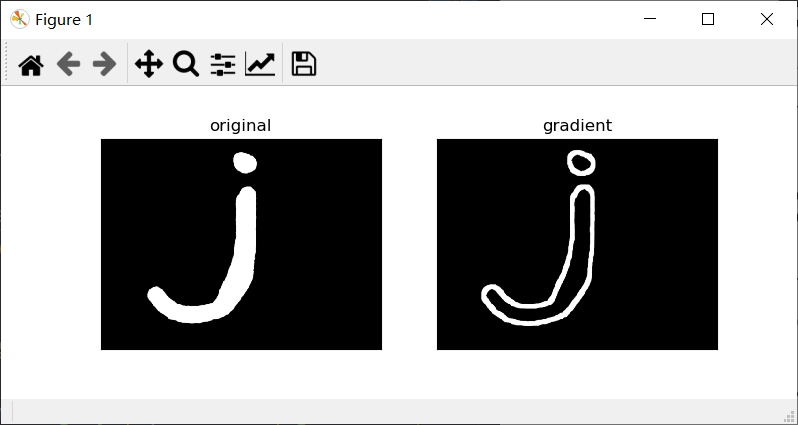

(8) 顶帽

- 顶帽的运算是输入图像减去开运算图像
- 代码演示（test_3_23_top_hat.py）
代码：

    ```pyhton
    import cv2 as cv
    import numpy as np
    from matplotlib import pyplot as plt

    img = cv.imread('./opencv_manual/test_image/gradient.bmp',0)
    kernel = np.ones((8, 8), np.uint8)
    tophat = cv.morphologyEx(img, cv.MORPH_TOPHAT, kernel)

    plt.subplot(121),plt.imshow(img, 'gray'),plt.title('original')
    plt.xticks([]), plt.yticks([])
    plt.subplot(122),plt.imshow(tophat, 'gray'),plt.title('tophat')
    plt.xticks([]), plt.yticks([])
    plt.show()
    ```

    运行结果：
    

(9) 黑帽

- 黑帽是闭运算图像减去输入图像
- 代码演示（test_3_24_black_hat.py）
代码：

    ```python
    import cv2 as cv
    import numpy as np
    from matplotlib import pyplot as plt

    img = cv.imread('./opencv_manual/test_image/gradient.bmp',0)
    kernel = np.ones((10,10), np.uint8)
    blackhat = cv.morphologyEx(img, cv.MORPH_BLACKHAT, kernel)

    plt.subplot(121),plt.imshow(img, 'gray'),plt.title('original')
    plt.xticks([]), plt.yticks([])
    plt.subplot(122),plt.imshow(blackhat, 'gray'),plt.title('blackhat')
    plt.xticks([]), plt.yticks([])
    plt.show()
    ```

    运行结果：  
    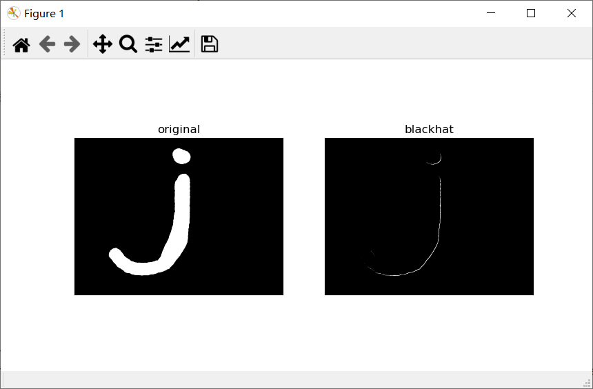

(10) 结构元素

- 在前面的例子中，我们在 Numpy 的帮助下手动创建了一个结构化元素。它是长方形的。但在某些情况下，可能需要椭圆形/圆形内核。因此，OpenCV 有一个函数 cv.getStructuringElement() 。只要传递内核的形状和大小，就可以得到所需的内核。
- 代码演示

    ```python
    # 矩形核
     >>> cv.getStructuringElement(cv.MORPH_RECT,(5,5))
     array([[1, 1, 1, 1, 1],
            [1, 1, 1, 1, 1],
            [1, 1, 1, 1, 1],
            [1, 1, 1, 1, 1],
            [1, 1, 1, 1, 1]], dtype=uint8)

    # 椭圆核
    >>> cv.getStructuringElement(cv.MORPH_ELLIPSE,(5,5))
    array([[0, 0, 1, 0, 0],
           [1, 1, 1, 1, 1],
           [1, 1, 1, 1, 1],
           [1, 1, 1, 1, 1],
           [0, 0, 1, 0, 0]], dtype=uint8)

    # 十字核
    >>> cv.getStructuringElement(cv.MORPH_CROSS,(5,5))
    array([[0, 0, 1, 0, 0],
           [0, 0, 1, 0, 0],
           [1, 1, 1, 1, 1],
           [0, 0, 1, 0, 0],
           [0, 0, 1, 0, 0]], dtype=uint8)
    ```

#### 3.2.6 图像梯度

(1) 目标

- 寻找图像梯度，边缘等。
- 学习函数： cv.Sobel(), cv.Scharr(), cv.Laplacian()

(2) 理论

- OpenCV 提供三种类型的梯度滤波器或高通滤波器： Sobel、Scharr 和 Laplacian。

(3) Sobel 和 Scharr 导数

- Sobel 算子是一种高斯平滑加微分的联合算子，因此对噪声的抵抗能力更强。
- 可以指定要获取的垂直或水平导数的方向（分别由参数 yorder 和 xorder 指定）。
- 可以通过 ksize 指定核的大小。
- 如果ksize=-1，则使用 3x3 Scharr 滤波器，其结果比 3x3 Sobel 滤波器更好。

(4) Laplacian 导数

- 代码演示（test_3_25_image_gradients.py）
代码：

    ```python
    import numpy as np
    import cv2 as cv
    from matplotlib import pyplot as plt

    img = cv.imread('./opencv_manual/test_image/sudoku.png',0)
    laplacian = cv.Laplacian(img,cv.CV_64F)
    sobelx = cv.Sobel(img,cv.CV_64F,1,0,ksize=5)
    sobely = cv.Sobel(img,cv.CV_64F,0,1,ksize=5)
    plt.subplot(2,2,1),plt.imshow(img,cmap = 'gray')
    plt.title('Original'), plt.xticks([]), plt.yticks([])
    plt.subplot(2,2,2),plt.imshow(laplacian,cmap = 'gray')
    plt.title('Laplacian'), plt.xticks([]), plt.yticks([])
    plt.subplot(2,2,3),plt.imshow(sobelx,cmap = 'gray')
    plt.title('Sobel X'), plt.xticks([]), plt.yticks([])
    plt.subplot(2,2,4),plt.imshow(sobely,cmap = 'gray')
    plt.title('Sobel Y'), plt.xticks([]), plt.yticks([])
    plt.show()
    ```

    运行结果：
    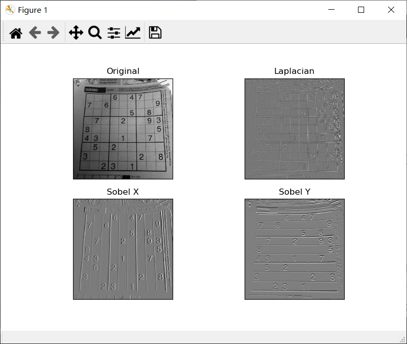

#### 3.2.7 Canny 边缘探测

(1) 目标

- 学会 Canny 边缘探测的概念
- 学习函数：cv.Canny()

(2) 理论

  


## 四. OpenCV 高级篇

### 4.1 特征检测与描述

### 4.2 视频分析

### 4.3 摄像机定标与三维重建

### 4.4 机器学习

### 4.5 计算摄影

### 4.6 目标检测

## 五. 总结